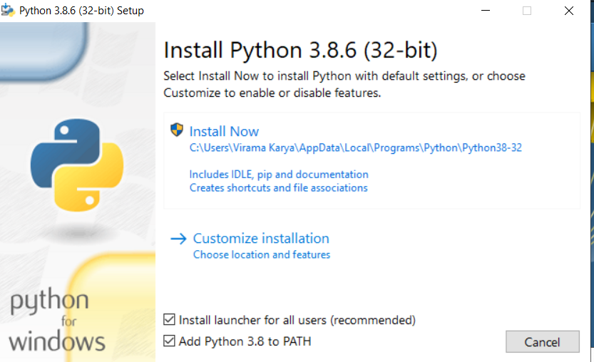
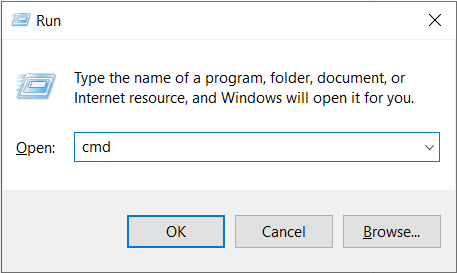
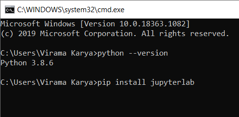
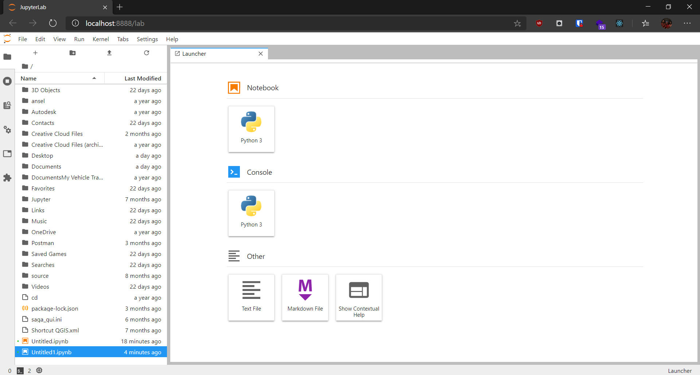

Continued from previous posts. How to / tutorials to install Jupyter Lab for Windows 10.

## Jupyter Lab

So if in the previous post I explained that I would install Jupyter Notebook, it turns out that there is already a new version, namely Jupyter Lab. So I just found out, and after a quick check, the UI is better than the classic Jupyter Notebook, but the features are still the same. Therefore, I chose Jupyter Lab to be the <abbr title = "Integerated Development Environment"> IDE </abbr> to accompany us next.

## Step by Step

Make sure the laptop / PC is connected to the internet beforehand to facilitate the installation process. Here are the steps:

1. Go to the python website and download python at https://www.python.org/downloads/. The latest version of python is also OK, the important thing is python version 3.x.

   

2. After downloading, run the downloaded file. And don't forget to check the two items below.

   

3. Run the command prompt with the keyboard combination Windows + R to bring up the run window, then type `cmd`.

   

4. Check whether Python is installed with the command `Python --version` in CMD. If the version appears then continue to install Jupyter Lab with the command `pip install jupyterlab`

   

5. After installing, type again at the command prompt `jupyter lab`, then the default browser will be opened automatically and the screen jupyter lab will appear.
   
   

## Done!

With this you can do programming, if it happens the screen still doesn't appear like in step 5 please googling first for the trouble shooting. So many tutorials to install Jupyter Lab. Happy Coding! 