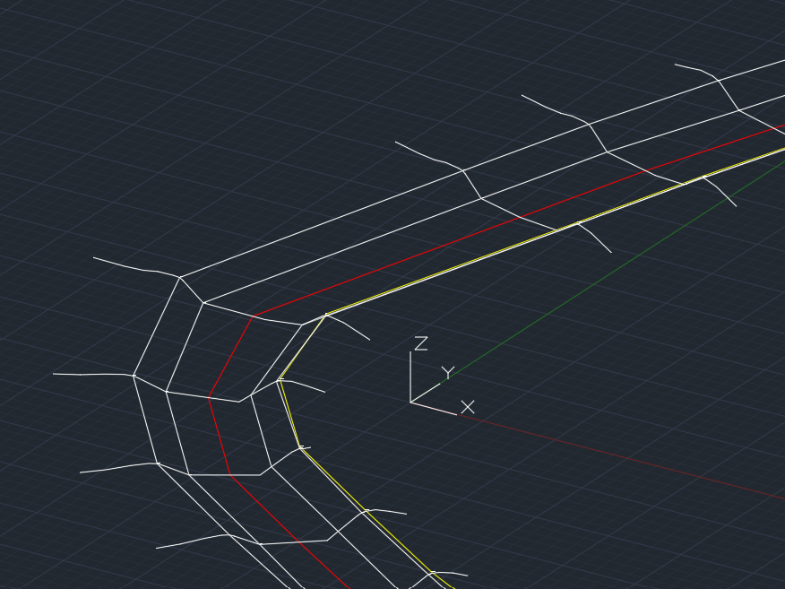
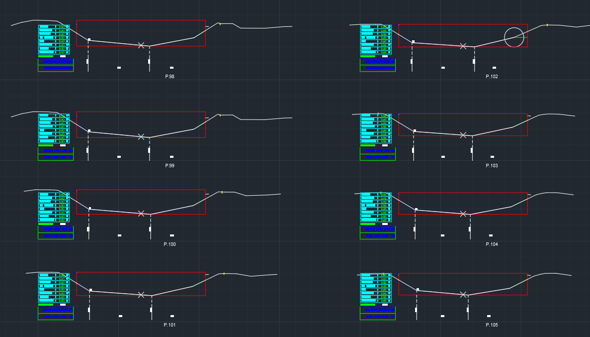
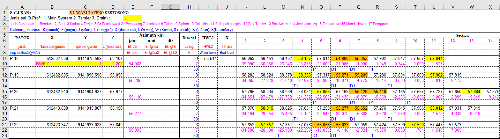
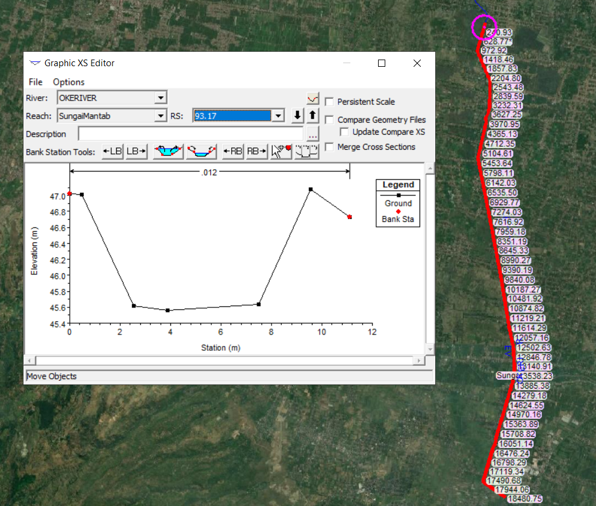
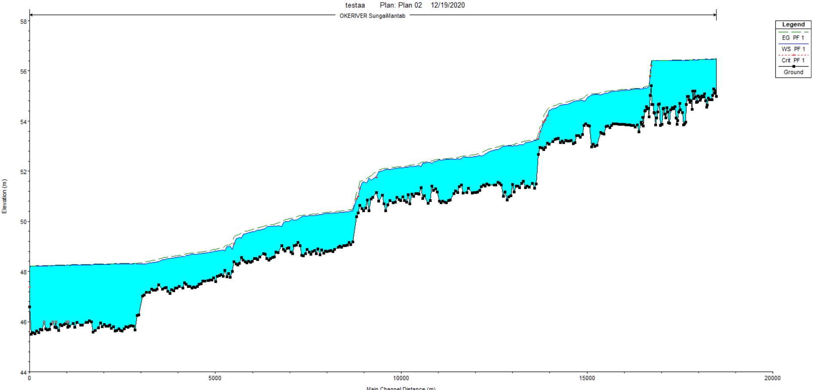

---
title: IRRIGATION PLAN LONG & CROSS
date: "2020-12-19T00:00:00.000Z"
description: "A program to make it easier for engineers and drafter to process survey results and calculations in irrigation projects.
This program was created with existing Irrigation / Modernization rehabilitation process in mind."
tags: ["coding","software"]
featuredImage: ./Plan3d.png
---

A program to make it easier for engineers and drafter to process survey results and calculations in irrigation projects.
This program was created with existing Irrigation / Modernization rehabilitation process in mind.

*Currently, the software name has not been determined. It will be decided when the software is released in beta.*
*This program or software is still under development.*

## Table of Contents

1. [Table of Contents](#table-of-contents)
2. [Purpose](#purpose)
3. [Feature Checklist](#feature-checklist)
4. [Milestones](#milestones)
5. [Technologies](#technologies)
6. [Galleries](#galleries)

## Purpose

- Increase drafter efficiency.
- Make it easy to draw Long, Cross, and Plan.
- Can be used for hydraulic analysis.
- Make it easy to check survey results.
- User friendly.
- Representative visual results.

## Checklist feature

 - ✅ Data input.
   - ✅ Input data from CSV.
   - ✅ Input data from TXT Tab delimited.
   - ⬜ Input data from XYZ style format.
   - ✅ Change the data from Jack style to XYZ Description style format.
   - ⬜ Change data from XYZ Description style format to Jack style.

 - ✅ Compatible with Autocad 2013+.

 - ⬜ Compatible with Autocad 2007 - 2012. **_Optional!_**

 - ⬜ GENERAL
   - ✅ Import Block from DWG.
   - ✅ Import Line Type.
   - ⬜ Create a new DWG block according to KP 07.
   - ⬜ Auto detecting base side of right and left channel.
   - ⬜ Requires LeftBank and RightBank input.
   
 - ✅ Super fast in processing data.
   - ✅ Using the CSV Helper library in processing data.
   - ✅ Using .NET C # technology.

 - ⬜ Draw a **PLAN**.
   - ✅ Read input data.
   - ✅ Create a class.
   - ✅ AutoCAD logic.
   - ⬜ Displays the trace.
   - ⬜ Using text annotation.
   - ⬜ Refined SQuadrant class 16 parts.
   - ⬜ Displays building location.
   - ⬜ KP Style 07.
 - ⬜ Draw **CROSS**.
   - ✅ Read input data.
   - ✅ Create a class.
   - ✅ AutoCAD logic.
   - ⬜ Creating a Border Box.
   - ⬜ Apply the existing design dimensions.
   - ⬜ Publish the results of earthworks and civil analysis.
   - ⬜ Extract analysis result data in CSV form.
   - ⬜ KP Style 07.
 - ⬜ Drawing **LONG**.
   - ⬜ Read input data.
   - ⬜ Create a class.
   - ⬜ AutoCAD logic.
   - ⬜ Creating a Border Box.
   - ⬜ Attach the design dimensions in the long graph.
   - ⬜ Can show damage at certain sides and locations.
   - ⬜ Automatically can take the track from the plan.
   - ⬜ KP Style 07.
 - ✅ Draw a **3D PLAN**.
 - ⬜ Model integration with Layout.
   - ⬜ Can directly move data from Model to Layout.
   - ⬜ Print PDF of all data models / layouts.
   - ⬜ Adjust the scale easily.
   - ⬜ Set paper with standard A1 and A3 sizes.
 - ⬜ Hec-RAS Integeration.
   - ✅ Can export .GEO to HEC-RAS.
   - ⬜ Complete .GEO features according to documentation in HEC-RAS v6.0.
   - ⬜ Integeration with HEC-RAS Interop / Controller. **_Optional!_**
 - ⬜ Graphical User Interface.
   - ⬜ Has a special Ribbon for this program.
   - ⬜ There is a toolbar for shortcuts.
   - ⬜ Display input data.
   - ⬜ Modify input data.
 - ⬜ Documentation.
   - ⬜ Make internal help .chm.
   - ⬜ Create PDF documentation for externals.
   - ⬜ Make an English version.
   - ⬜ Upload to website.
   - ⬜ Make youtube video tutorials.
 - ⬜ Security.
   - ⬜ Program protection with crypto.
   - ⬜ Added trial version and full version.
   - ⬜ Add EULA template.
 - ⬜ Bundler installer.
   - ⬜ Deploy the installation with WIXtoolset.
   - ⬜ The program can be installed.
   - ⬜ The program can be uninstalled.
   - ⬜ Program can be updated. **_Optional!_**
   
## Milestones

- March 14, 2020 Deploy simple AutoCAD program to GitHub [https://github.com/billymosis/AutoCAD](#https://github.com/billymosis/AutoCAD)
- April 5, 2020 First LinkedIn post. [https://www.linkedin.com/posts/billymosis_irrigation-drains-earthworks-activity-6652566078788591616-MRne](#https://www.linkedin.com/posts/billymosis_irrigation-drains-earthworks-activity-6652566078788591616-MRne )
- June 23, 2020 PLC first commit project to GitHub. [https://github.com/billymosis/Long-Cross](#https://github.com/billymosis/Long-Cross)
- December 19, 2020 This feature list was created.

## Technologies
- .Net Framework 4.5
- C# 5.0
- Visual Studio 2017
- CSVHelper
- AutoCAD .NET API 2013
 
## Galleries

* This page will continue to be updated according to the progress of the software. *

© Created by Billy Mosis Priambodo, 2020.